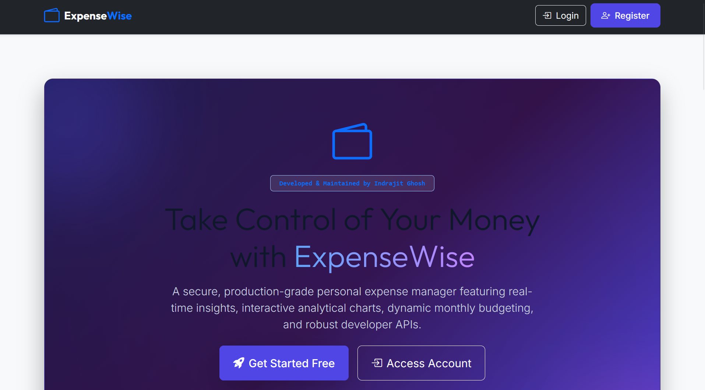
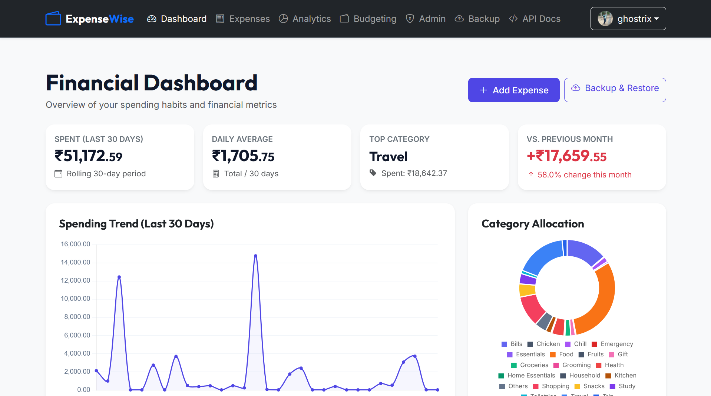
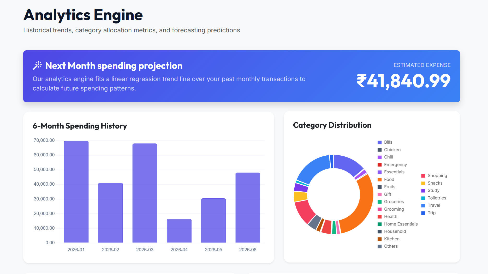
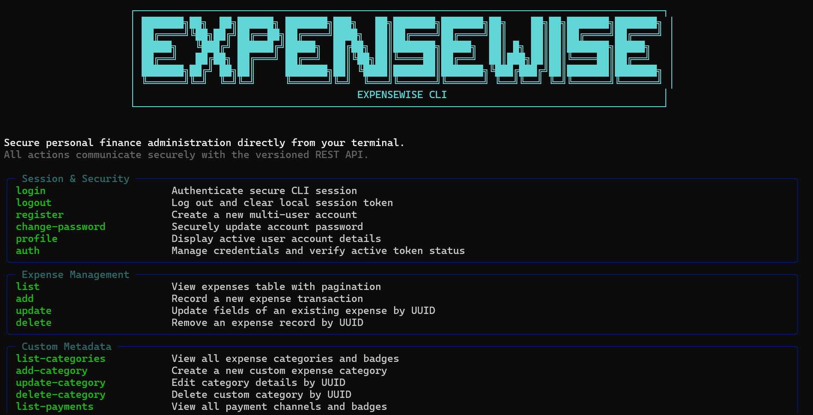
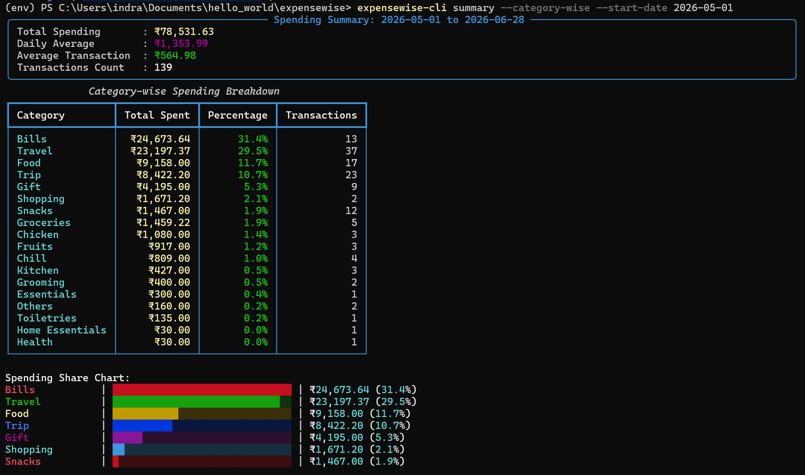
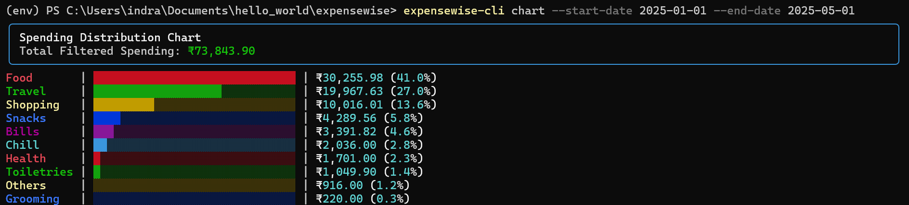

# ExpenseWise

[](https://www.python.org/)
[](https://flask.palletsprojects.com/)
[](./LICENSE)
[](#)

**ExpenseWise** is a production-ready, highly secure personal finance management platform. It features multi-user sandboxing, transparent database-level encryption at rest, rolling analytics, linear regression forecasting, dynamic monthly budget planning, and versioned developer REST APIs with an installable command-line client.

* **Maintainer:** Indrajit Ghosh
* **Role:** Math Postdoctoral Researcher, IIT Kanpur
* **Website:** [https://indrajitghosh.onrender.com](https://indrajitghosh.onrender.com)
* **GitHub Repository:** [https://github.com/indrajit912/expensewise](https://github.com/indrajit912/expensewise)
* **Live Web Application:** [https://expensewise.pythonanywhere.com](https://expensewise.pythonanywhere.com)

---

## Table of Contents

1. [Project Overview](#1-project-overview)
2. [Features](#2-features)
3. [Technology Stack](#3-technology-stack)
4. [Installation](#4-installation)
5. [Maintainer Setup Guide](#5-maintainer-setup-guide)
6. [ExpenseWise CLI](#6-expensewise-cli)
7. [REST API Documentation](#7-rest-api-documentation)
8. [Project Structure](#8-project-structure)
9. [Configuration](#9-configuration)
10. [Deployment](#10-deployment)
11. [Contributing](#11-contributing)
12. [Roadmap](#12-roadmap)
13. [License](#13-license)

---

## 1. Project Overview

ExpenseWise is built to address the privacy concerns of storing sensitive daily transactional data online. By implementing user-level encryption keys derived from active credentials, the system ensures that expense amounts, categories, and descriptions are completely unreadable in the SQLite or PostgreSQL database unless an active session is validated.

Furthermore, it offers tools to automate budgeting decisions, project spending averages, and interface directly with local terminal scripts to keep developer workflows integrated.


*Figure 1: ExpenseWise web application homepage showcasing secure session gateways and developer portals.*

---

## 2. Features

* **Secure Authentication:** Multi-factor checks utilizing password hashing and optional OTP verify routines.
* **Encrypted Storage:** Zero-knowledge data model encrypting values using symmetric AES-256 keys (Fernet) unique to each user.
* **Intelligent Budget Planning:** Calculates 3-month category averages, provides inline target recommendations, and renders allowance indicators.
* **Indian Number System Formatting:** Consistently groups digits in Indian standard format (`12,30,445.00`) across tables, summaries, and charts.
* **Dashboard & Visual Analytics:** Real-time statistics, monthly variance indicators, interactive spending trend lines, and category distribution doughnuts.
* **Custom Category/Payment Settings:** Create custom tags with unique hex colors, and access shortcuts from the Add Expense form.
* **JSON Portability:** Safe JSON backup export/import module executing multi-stage integrity and validation schema checks before execution.
* **Installable CLI Client:** Rich command-line client supporting registration, logging, list pagination, and summaries.
* **Versioned REST API:** Secure endpoints backed by JSON schemas and API access key authorizations.
* **Gravatar Profile Support:** Circular user avatars calculated from secure email hashes.
* **Responsive UI:** Clean CSS layouts with glassmorphic cards, transition animations, and dark navbar headers.


*Figure 2: The web dashboard displaying key metrics, daily spending visual trends, category breakdown charts, and current rolling summaries.*


*Figure 3: Spending analytics panel displaying historical budget variances and linear regression forecast trends.*

---

## 3. Technology Stack

* **Core Runtime:** Python (3.13+)
* **Web Framework:** Flask (3.0+) using the Application Factory Pattern
* **Database & ORM:** SQLite (dev) / PostgreSQL (prod), SQLAlchemy Core & Flask-SQLAlchemy, Alembic (Flask-Migrate)
* **Security & Auth:** Flask-Login, Flask-WTF, Flask-Talisman, Flask-Limiter, Cryptography (Fernet symmetric encryption)
* **Analytics Engine:** Pandas for aggregations, NumPy for linear regression forecasts
* **Front-End Styling:** Bootstrap 5, Custom Vanilla CSS (glassmorphism details)
* **Visualizations:** Chart.js, Bootstrap Icons
* **CLI Library:** Click, Rich (color tables and dashboard panels)
* **Testing Suite:** Pytest

---

## 4. Installation

Follow these steps to set up the development environment on your local system:

### 1. Clone the Repository
```bash
git clone https://github.com/indrajit912/expensewise.git
cd expensewise
```

### 2. Configure Virtual Environment
```bash
# Create the virtual environment
python -m venv venv

# Activate on Windows (PowerShell)
.\venv\Scripts\Activate.ps1
# Activate on Linux/macOS
source venv/bin/activate
```

### 3. Install Dependencies
```bash
pip install -r requirements.txt -r requirements/dev.txt
```

### 4. Setup Environment Variables
Copy the `.env.example` file to `.env`:
```bash
# On Windows (PowerShell)
Copy-Item .env.example .env
# On Linux/macOS
cp .env.example .env
```
Open `.env` and set `FLASK_DEBUG=1`. You can also configure Hermes Email settings and customized Admin credentials if desired.

### 5. Run Database Setup and Launch
Initialize the schema and start the local development server:
```bash
# Initialize and seed database
flask setup-project

# Launch local server
flask run
```
Access the application at [http://127.0.0.1:5000/](http://127.0.0.1:5000/).

---

## 5. Maintainer Setup Guide

This guide details commands and workflows required by maintainers to develop and deploy ExpenseWise.

### The Unified Setup Tool
We have implemented a custom setup command that replaces manual migration deletions and seeding:
```bash
flask setup-project
```
**Workflow Executed:**
1. Prompts for confirmation before making changes.
2. Removes `instance/` and `migrations/` directories.
3. Initializes migrations (`flask db init`).
4. Generates initial schema maps (`flask db migrate`).
5. Performs DB upgrade (`flask db upgrade`).
6. Seeds system categories and configs (`flask bootstrap-system`).
7. Creates a default developer sandbox user (`flask create-guest`).

### Seeding Commands (Manual)
If you wish to seed values manually without resetting migrations, you can run:
```bash
# Seeding default global system categories
flask bootstrap-system

# Create the standard guest user (Username: guest, Password: password)
flask create-guest
```

### Database Schema Updates
Whenever you modify database models, generate and apply migrations:
```bash
flask db migrate -m "Description of model change"
flask db upgrade
```

### Running Tests
Execute the pytest suite to verify model math, encryption security, and API endpoints:
```bash
python -m pytest
```

---

## 6. ExpenseWise CLI

`expensewise-cli` is a standalone, terminal-based personal financial assistant that communicates exclusively with the server using the versioned REST API.


*Figure 4: The custom-styled command help menu of the CLI showing formatted group listings and resources.*

### Installation

You have three options to install the CLI:

#### Option 1: Direct pip Installation from GitHub (Recommended for End Users)
Install directly from the GitHub repository without cloning:
```bash
pip install git+https://github.com/indrajit912/expensewise.git#subdirectory=cli
```

#### Option 2: Editable Installation from Local Repository (For Development)
Clone the repository and install in editable mode:
```bash
git clone https://github.com/indrajit912/expensewise.git
cd expensewise/cli
pip install -e .
```

#### Option 3: Standard Installation from Local Repository
Clone and perform a standard pip installation:
```bash
git clone https://github.com/indrajit912/expensewise.git
cd expensewise/cli
pip install .
```

Once installed via any method above, the CLI tool is globally available in your environment via the `expensewise-cli` executable.

### Updating the CLI

To update to the latest version from GitHub:

#### For Option 1 (Direct GitHub Installation):
```bash
pip install --upgrade git+https://github.com/indrajit912/expensewise.git#subdirectory=cli
```

#### For Option 2 & 3 (Local Repository):
Navigate to the `cli` directory and upgrade:
```bash
pip install --upgrade .
```

Or in editable mode:
```bash
pip install --upgrade -e .
```

### Configuration
By default, the CLI connects to the local development environment at `http://localhost:5000/api`. To point the CLI to a remote deployment (e.g. PythonAnywhere production instance), you can configure a persistent local URL or use an environment variable override.

The CLI resolves the API Server URL using the following priority order:
1. **Environment Variable Override** (Highest priority, temporary override for the active shell session)
2. **Local Configuration File** (Stored in `~/.expensewise/config.json`)
3. **Default Fallback**: `http://localhost:5000/api`

#### Managing the Server URL via the CLI

* **View active server URL and resolution source:**
  ```bash
  expensewise-cli config show
  ```

* **Set a persistent API server URL:**
  ```bash
  expensewise-cli config set-url https://expensewise.pythonanywhere.com/api
  ```

* **Reset server URL to the default (http://localhost:5000/api):**
  ```bash
  expensewise-cli config reset
  ```

* **Temporary environment override:**
  ```bash
  # Windows PowerShell
  $env:EXPENSEWISE_API_URL="https://expensewise.pythonanywhere.com/api"

  # Linux/macOS
  export EXPENSEWISE_API_URL="https://expensewise.pythonanywhere.com/api"
  ```

### Account Registration & Self-Service Email Verification

When registering a new account, a 6-digit One-Time Password (OTP) is sent to the registered email address. This verification code has a validity lifetime of **5 minutes**.

* **Self-Service Verification Recovery Flow:** If your verification code expires before you enter it, or if you close the registration screen, you can complete email verification at any time:
  1. Simply log in with your email/username and password.
  2. If the account is unverified, the system will redirect you to the **Verify Account** page.
  3. If your previous OTP has expired, you will see a notice stating that the code has expired.
  4. Click the **Resend Verification OTP** button to generate a new 5-minute code, which is instantly sent to your email.
* **Rate Limiting Security:** To prevent abuse, OTP regeneration requests are rate-limited to a **60-second cooldown** interval.
* **API Endpoint:** Unverified API/CLI client logins receive a `403 Forbidden` response containing the user details. You can request a new verification OTP by calling `/api/v1/auth/resend-otp` with JSON payload `{"email": "your_email@example.com"}`.

### Obtaining an API Token & Authentication
To log in securely, run:
```bash
expensewise-cli login
```
This prompts you to choose between:
1. **Email & Password**: Direct credential authentication.
2. **API Token**: Secure token entry (non-echoed interactive password prompt).

Alternatively, you can securely configure or update a token directly using:
```bash
expensewise-cli auth token
```

#### API Token Lifetimes & Permissions

By default, newly generated API tokens expire in **1 day** for standard users. This minimizes credential leakage window sizes on personal environments.

* **Custom Token Lifespans:** Users with the `can_create_custom_api_tokens` capability, or accounts possessing **Admin** / **Super Admin** roles, can configure custom API token lifespans (between **1 and 365 days**) during generation.
* **Administrator Workflow:** Administrators can grant or revoke the custom API token lifetime permission for any regular user account directly from the **Admin Panel** (`/admin`). Toggling this option instantly updates the user's Settings form inputs and enforces lifecycle parameters on the backend REST controller.

#### Secure Storage Backend
To follow security best practices, `expensewise-cli` automatically integrates with your operating system's secure credential/keyring manager (e.g., Windows Credential Manager or macOS Keychain via the `keyring` package). If no secure keyring is available, it falls back to writing the token to a secure file at `~/.expensewise/auth.json` initialized with restricted read/write permissions (`chmod 600`).

To check the current authentication status (without revealing the full token), run:
```bash
expensewise-cli auth status
```

To sign out and permanently delete all local credential configurations, run:
```bash
# Clear local credentials only (default, stored token remains valid on the server)
expensewise-cli logout

# Clear local credentials AND revoke/delete the token on the server
expensewise-cli logout --revoke
```

### Command Reference & Examples

#### User & Account Information
* **Show account details:**
  ```bash
  expensewise-cli profile
  ```
* **Change password:**
  ```bash
  expensewise-cli change-password
  ```

#### Expense Management
* **List expenses with paginated scroll:**
  ```bash
  expensewise-cli list
  ```
* **List expenses with category/date range filters:**
  ```bash
  expensewise-cli list --category=Food --start-date=2026-06-01 --end-date=2026-06-30
  ```
* **Record a transaction:**
  ```bash
  expensewise-cli add --amount=450.00 --category=Food --payee="Walmart"
  ```
* **Modify fields on a record:**
  ```bash
  expensewise-cli update <UUID> --amount=520.00 --description="Weekly shopping run"
  ```
* **Delete a record:**
  ```bash
  expensewise-cli delete <UUID>
  ```

#### Category & Payment Channels Customization
* **List categories:**
  ```bash
  expensewise-cli list-categories
  ```
* **Create a custom category:**
  ```bash
  expensewise-cli add-category --name="Subscribers" --color="#10b981"
  ```
* **List payment methods:**
  ```bash
  expensewise-cli list-payments
  ```

#### Budget Planning
* **Show budget comparisons vs actual spending:**
  ```bash
  expensewise-cli budget-show
  ```
* **Show spending budget recommendations:**
  ```bash
  expensewise-cli budget-suggest
  ```
* **Set category budget target limit:**
  ```bash
  expensewise-cli budget-set --month=2026-07 --category=Food --amount=5000.00
  ```
* **Clear category budget target:**
  ```bash
  expensewise-cli budget-delete 2026-07 Food
  ```

#### Portability Backup Files
* **Export database backup locally:**
  ```bash
  expensewise-cli export-backup backup.json
  ```
* **Import database backup from local JSON file:**
  ```bash
  expensewise-cli import-backup backup.json
  ```

#### Terminal Spending Summaries & Visual Charts
Display spending summaries, rolling financial indicators, and forecast projections, or generate category allocation bar charts in the terminal:

* **Show spending summary over a date range:**
  ```bash
  expensewise-cli summary --start-date=2026-01-01 --end-date=2026-05-31
  ```
  *Displays total spending, transaction count, average transaction, and daily average.*

* **Show category-wise breakdown table and share chart:**
  ```bash
  expensewise-cli summary --category-wise --start-date=2026-01-01 --end-date=2026-05-31
  ```

* **Display rolling 30-day indicators, comparisons, and forecasts (Default summary view):**
  ```bash
  expensewise-cli summary
  ```
  *(Note: The backward-compatible command alias `expensewise-cli analytics` can be used interchangeably.)*

  
  *Figure 5: Custom-styled spending summaries displaying daily average metrics, MoM budget difference indicators, and linear regression forecast panels.*

* **Generate category allocation bar charts:**
  ```bash
  expensewise-cli chart
  expensewise-cli chart --start-date=2026-06-01 --end-date=2026-06-30
  ```

### Visual Chart Mockup
```text
  [ Spending Distribution Chart ]
  Total Spending: ₹12,300.00

  Food         | ██████████████████████████████  | ₹6,000.00 (48.8%)
  Rent         | ██████████████████              | ₹3,500.00 (28.5%)
  Utilities    | ██████████                      | ₹2,000.00 (16.3%)
  Other        | ████                            | ₹800.00 (6.5%)
```


*Figure 6: CLI-generated spending distribution bar charts using Unicode block elements and custom-coded colors.*

---

## 7. REST API Documentation

ExpenseWise provides a versioned, developer-friendly REST API for custom client integrations, shell scripting, or data analysis.

### API Overview
* **Base URL:** `/api` (e.g. `http://localhost:5000/api` or `https://expensewise.pythonanywhere.com/api`)
* **Protocol:** HTTPS (Enforced on production servers)
* **Payload Format:** JSON for all request bodies and responses
* **In-App Interactive Docs:** Fully integrated interactive API docs are served at the following routes (access requires login):
  * **Interactive developer guide:** `/docs` (collapsible cards and schemas)
  * **Swagger UI test console:** `/docs/swagger` (lets you test endpoints directly from the browser)
  * **ReDoc reference sheet:** `/docs/redoc` (structured 3-pane reference layout)

### Authentication
Secure routes require an API Access Token passed in the HTTP headers. You can generate and copy these tokens from the **Settings & API Token** section in your profile dropdown.

**Header Format:**
```http
Authorization: Bearer <YOUR_API_TOKEN>
Content-Type: application/json
```

### Endpoints Summary Reference

| Method | Endpoint | Description | Auth Required |
| :--- | :--- | :--- | :--- |
| **POST** | `/api/v1/auth/register` | Create a new user profile (triggers verification OTP) | No |
| **POST** | `/api/v1/auth/verify-otp`| Verify email registration OTP to activate account | No |
| **POST** | `/api/v1/auth/resend-otp`| Request a fresh verification OTP for unverified account | No |
| **POST** | `/api/v1/auth/login` | Exchange credentials for a Bearer access token | No |
| **POST** | `/api/v1/auth/logout` | Revoke/delete the active session token on the server | Yes |
| **GET** | `/api/v1/expenses` | Query paginated lists of expenses with search & date filters | Yes |
| **POST** | `/api/v1/expenses` | Save a new expense entry (payload encrypted on disk) | Yes |
| **GET** | `/api/v1/expenses/<uuid>` | Fetch full details of a single expense record | Yes |
| **PUT** | `/api/v1/expenses/<uuid>` | Edit details of a record | Yes |
| **DELETE**| `/api/v1/expenses/<uuid>` | Delete a record | Yes |
| **GET** | `/api/v1/categories` | List user custom category definitions and colors | Yes |
| **POST** | `/api/v1/categories` | Add a new custom category | Yes |
| **GET** | `/api/v1/payment-methods` | List custom payment modes | Yes |
| **GET** | `/api/v1/analytics/summary`| Fetch range-filtered totals, daily averages, and category lists | Yes |
| **GET** | `/api/v1/analytics/trends` | Fetch category allocations data | Yes |
| **GET** | `/api/v1/export` | Backup the database to JSON v2.0 | Yes |
| **POST** | `/api/v1/import` | Restore/merge the database from JSON v2.0 | Yes |

---

### Example Integrations

#### 1. Save a New Expense (cURL Command)
```bash
curl -X POST http://localhost:5000/api/v1/expenses \
  -H "Authorization: Bearer YOUR_API_TOKEN" \
  -H "Content-Type: application/json" \
  -d '{
    "amount": 1250.75,
    "category": "Shopping",
    "expense_date": "2026-06-28",
    "payee": "Amazon",
    "payment_mode": "Credit Card",
    "description": "Office supplies"
  }'
```

#### 2. Fetch Spending Averages over Date Range (Python script)
```python
import requests

api_url = "http://localhost:5000/api/v1/analytics/summary"
token = "YOUR_API_TOKEN"

headers = {
    "Authorization": f"Bearer {token}",
    "Content-Type": "application/json"
}

params = {
    "start_date": "2026-01-01",
    "end_date": "2026-05-31",
    "category-wise": "true"
}

res = requests.get(api_url, headers=headers, params=params)
if res.status_code == 200:
    data = res.json()
    metrics = data.get("metrics", {})
    print(f"Total Spent: {metrics.get('total_spending')}")
    print(f"Daily Average: {metrics.get('daily_average')}")
    for cat in data.get("categories", []):
        print(f" - {cat['category']}: {cat['total']} ({cat['pct']}%)")
else:
    print(f"Error {res.status_code}: {res.text}")
```

#### 3. CLI Client Equivalent
```bash
expensewise-cli summary --start-date 2026-01-01 --end-date 2026-05-31 --category-wise
```

---

## 8. Project Structure

```text
expensewise/
├── app/
│   ├── api/                 # Versioned developer REST API endpoints & schemas
│   ├── auth/                # Sign-up, login, recovery routes and views
│   ├── dashboard/           # User metrics controllers, settings, budgets
│   ├── expenses/            # CRUD listings, filters, JSON backup/restore UI
│   ├── analytics/           # Deep analytics indicators & forecasts graphs
│   ├── cli/                 # Custom management commands (setup-project, etc.)
│   ├── services/            # Database encryption, JSON checks, analytics service
│   ├── models/              # User, Expense, APIToken, Budget database mappings
│   ├── static/              # CSS files, global JS modules
│   ├── templates/           # Jinja base layouts and modular fragments
│   └── extensions.py        # Extensions setup (db, migrate, limiter, etc.)
├── cli/                     # Setup.py and code for the expensewise-cli package
├── migrations/              # Database migration version files
├── tests/                   # Pytest automation scripts
├── config.py                # Development, Testing, Production configurations
└── manage.py                # Main application wrapper entrypoint
```

---

## 9. Configuration

Configure the application behavior using the following environment variables:

| Variable | Description | Default |
| :--- | :--- | :--- |
| `SECRET_KEY` | Symmetric token used to secure session cookies | Random hex key |
| `SECURITY_PASSWORD_SALT`| Salt key for generating recovery hashes | Random hex key |
| `DATABASE_URL` | SQLAlchemy connection URL | SQLite location |
| `FLASK_DEBUG` | Starts development server in debug mode if `1` | `0` |
| `HERMES_API_KEY` | Hermes Service access key (Email delivery) | `None` |

---

## 10. Deployment

### Production Flag
When deploying in production, ensure `FLASK_DEBUG=0` is set in the production dashboard. This automatically activates the `ProductionConfig` settings, which disable local SQLite fallbacks, enforce strict HTTPS redirects using `Flask-Talisman`, and disable debug trace logging.

### WSGI Configuration
To serve the app via Gunicorn:
```bash
gunicorn -w 4 "manage:app"
```

---

## 11. Contributing

We welcome contributions to ExpenseWise! Please follow these guidelines:
1. Fork the repository and create a feature branch (`git checkout -b feature/amazing-feature`).
2. Write clean Python code complying with PEP 8.
3. Add unit test assertions for any new service calculations or routes.
4. Run `python -m pytest` to verify that all tests pass.
5. Create a detailed Pull Request describing the changes.

---

## 12. Roadmap

* **Multi-Currency Aggregations:** Display dashboard analytics conversions dynamically across selected user standard currencies.
* **Visual Budget Alerts:** Configurable system alerts when spending threshold limits exceed 80% of category budget limits.
* **Recurring Transactions:** Automate monthly subscription records creation.
* **OIDC Integrations:** Support for signing in using OAuth 2.0 (Google, GitHub accounts).

---

## 13. License

This project is licensed under the terms of the MIT License. See the [LICENSE](./LICENSE) file for the full text. The MIT License is appropriate for this project as it permits modification, distribution, commercial use, and private hosting, allowing developers to adapt ExpenseWise for their own needs while providing the maintainer complete liability protection.
