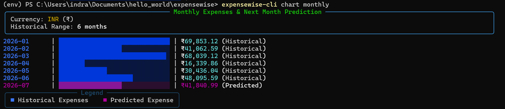

# ExpenseWise

[](https://www.python.org/)
[](https://flask.palletsprojects.com/)
[](./LICENSE)
[](#)

**ExpenseWise** is a production-ready, highly secure personal monthly expense management platform. It features multi-user sandboxing, transparent database-level encryption at rest, rolling analytics, linear regression forecasting, dynamic monthly budget planning, and versioned developer REST APIs with an installable command-line client.

**Developer:** **[Indrajit Ghosh](https://github.com/indrajit912)**, Postdoctoral Researcher, IIT Kanpur
* **Website:** [https://indrajitghosh.onrender.com](https://indrajitghosh.onrender.com)
* **GitHub Repository:** [https://github.com/indrajit912/expensewise](https://github.com/indrajit912/expensewise)
* **Live Web Application:** [https://expensewise.pythonanywhere.com](https://expensewise.pythonanywhere.com)

---

## Table of Contents

1. [Project Overview](#1-project-overview)
2. [Features & Walkthrough](#2-features--walkthrough)
3. [ExpenseWise CLI](#3-expensewise-cli)
4. [REST API Documentation](#4-rest-api-documentation)
5. [Local Development & Maintainer Guide](#5-local-development--maintainer-guide)
6. [Project Structure](#6-project-structure)
7. [Configuration](#7-configuration)
8. [Deployment](#8-deployment)
9. [Contributing](#9-contributing)
10. [Roadmap](#10-roadmap)
11. [License](#11-license)

---

## 1. Project Overview

ExpenseWise is a comprehensive **personal monthly expense management platform** built to address the privacy concerns of storing sensitive transactional data online. By implementing user-level encryption keys derived from active credentials, the system ensures that expense amounts, categories, and descriptions are completely unreadable in the SQLite or PostgreSQL database unless an active session is validated.

With ExpenseWise, users can:
* **Record daily expenses** with optional payee, payment mode, and description notes.
* **Organize expenses into custom categories** with distinctive colors and badges.
* **Manage accounts and payment modes** (e.g., Credit Cards, Cash, Bank Accounts).
* **Track monthly spending** and compare current outlays against set budgets.
* **Visualize expenses** through rich, interactive charts in both the web app and the console.
* **Obtain insightful analytics and spending trends**, including rolling averages and forecasts.
* **Monitor financial habits over time** to make smarter budget choices.
* **Access the platform seamlessly** via either the **Web Application** or the **Command-Line Interface (CLI)**.


*Figure 1: ExpenseWise web application homepage showcasing secure session gateways and developer portals.*

---

## 2. Features & Walkthrough

* **Secure Authentication:** Multi-factor checks utilizing password hashing and optional OTP verify routines.
* **Encrypted Storage:** Zero-knowledge data model encrypting values using symmetric AES-256 keys (Fernet) unique to each user.
* **Intelligent Budget Planning:** Calculates 3-month category averages, provides inline target recommendations, and renders allowance indicators.
* **Indian Number System Formatting:** Consistently groups digits in Indian standard format (`12,30,445.00`) across tables, summaries, and charts.
* **Dashboard & Visual Analytics:** Real-time statistics, monthly variance indicators, interactive spending trend lines, and category distribution doughnuts.
* **Custom Category/Payment Settings:** Create custom tags with unique hex colors, and access shortcuts from the Add Expense form.
* **JSON Portability:** Safe JSON backup export/import module executing multi-stage integrity and validation schema checks before execution.
* **Installable CLI Client:** Rich command-line client supporting registration, logging, list pagination, and summaries.
* **Versioned REST API:** Secure endpoints backed by JSON schemas and API access key authorizations.
* **Gravatar Profile Support:** Circular user avatars calculated from secure email hashes.
* **Responsive UI:** Clean CSS layouts with glassmorphic cards, transition animations, and dark navbar headers.


*Figure 2: The web dashboard displaying key metrics, daily spending visual trends, category breakdown charts, and current rolling summaries.*


*Figure 3: Spending analytics panel displaying historical budget variances and linear regression forecast trends.*

---

## 3. ExpenseWise CLI

For users who prefer working directly from the terminal, ExpenseWise includes an installable command-line assistant (`expensewise-cli`) that communicates securely with the server via the REST API.


*Figure 4: The custom-styled command help menu of the CLI showing formatted group listings and resources.*

### Installation

Install the CLI globally in your Python environment using one of the following methods:

#### Using pip (Recommended for End Users)
```bash
pip install --upgrade git+https://github.com/indrajit912/expensewise.git#subdirectory=cli
```

#### Using pipx (Recommended for Isolated Applications)
```bash
pipx install git+https://github.com/indrajit912/expensewise.git#subdirectory=cli
```

### Configuration & Authentication

By default, the CLI connects to `http://localhost:5000/api`. To point it to a remote deployment:
```bash
# Set production server URL
expensewise-cli config set-url https://expensewise.pythonanywhere.com/api

# View active config status
expensewise-cli config show
```

Authenticate your terminal session by logging in:
```bash
expensewise-cli login
```
This stores your access credentials securely in your operating system's native keychain (e.g. Windows Credential Manager or macOS Keychain via the `keyring` package). It also tracks your login session locally inside `~/.expensewise/session.json` using timezone-aware timestamps. If a session is older than **1 hour**, the CLI will automatically log you out and sign you in again.

To check your session credentials status:
```bash
expensewise-cli auth status
```

---

### Command Reference & Examples

#### 1. Add an Expense (Interactive Mode)
Running the `add` command with just the required `--amount` parameter launches interactive prompts for the remaining fields:
```bash
expensewise-cli add --amount 1250
```
* **Date**: Prompts for transaction date (press **Enter** to default to today).
* **Category**: Lists available categories from your database in a numbered menu. Select by number, exact name, or partial keyword match.
* **Payment Mode**: Lists payment channels in a numbered menu. Select by number, exact name, or partial keyword match.
* **Payee & Description**: Optional text inputs (press **Enter** to leave blank).

*Example Interactive Flow:*
```text
Transaction Date [YYYY-MM-DD] (default: 2026-06-29): [Enter]

Select Category:
  1) Food
  2) Travel
Choose category (enter number or name): 1

Select Payment Mode:
  1) Cash
  2) Credit Card
Choose payment mode (enter number or name): 2

Enter Payee Name (optional): Walmart
Enter Description/Notes (optional): Weekly grocery run
```

#### 2. Add an Expense (Scripting Mode)
Specify all options directly on the command line to bypass prompts in scripts or automated pipelines:
```bash
expensewise-cli add --amount 450.00 --category Food --date-str 2026-06-28 --payee "Walmart" --mode Cash --description "Weekly snacks"
```

#### 3. Update an Expense (Interactive Flags Mode)
Specify the required `--uuid` and use boolean flags to select which fields to update interactively:
```bash
expensewise-cli update --uuid 8a4c107f-7bde-4e3b-b7fb-6cb1a8c081e2 --amount --payee
```
This displays current transaction values, prompts for new values for the selected flags, renders a changes table, and asks for confirmation before saving.

*Example Interactive Flow:*
```text
+--- Current Transaction Details --------------------+
| Category:    Food                                  |
| Amount:      150.00                                |
| Date:        2026-06-29                            |
| Payee:       None                                  |
| Mode:        Cash                                  |
| Description: None                                  |
+----------------------------------------------------+

Amount [Current: 150.0]: 165.50
Payee [Current: ]: Walmart

Summary of Proposed Changes:
+---------------+----------------+-----------+
| Field         | Original Value | New Value |
+---------------+----------------+-----------+
| Amount        | 150.0          | 165.5     |
| Payee         |                | Walmart   |
+---------------+----------------+-----------+
Do you want to save these modifications? [Y/n]: y
Success! Transaction updated successfully. Modified fields: Amount, Payee.
```

#### 4. List and Delete Expenses
```bash
# View list of expenses (paginated)
expensewise-cli list

# Filter list
expensewise-cli list --category Food --start-date 2026-06-01

# Delete an entry by UUID (requires confirmation)
expensewise-cli delete <UUID>
```

#### 5. Chart Categories
Plots a terminal-based bar chart of category distribution:
```bash
expensewise-cli chart --start-date 2026-06-01 --end-date 2026-06-30
```

*Figure 5: CLI-generated spending distribution bar charts using Unicode block elements and custom-coded colors.*

#### 6. Chart Monthly Trends & Next Month Prediction
Plots monthly historical expenses and integrates next month's forecast:
```bash
expensewise-cli chart monthly
expensewise-cli chart monthly --months 12
```
This calls the regression engine on the server to project the next month's spending and draws the forecast bars:


*Figure 6: CLI-generated monthly trends chart comparing historical totals with next month's projected expense forecast.*

#### 7. Update CLI Client
Keep your client updated to the latest code on GitHub interactively:
```bash
expensewise-cli self-update
```

---

## 4. REST API Documentation

ExpenseWise provides a versioned REST API for developers who prefer custom integrations, programmatic access, or data backups.

* **Interactive Documentation**: Complete Swagger UI (`/docs/swagger`), ReDoc reference sheets (`/docs/redoc`), and the collateral developer guide ([/docs](https://expensewise.pythonanywhere.com/docs)) are served publicly from the web application (no login required).
* **API Access Tokens**: Secure routes require passing an API Access Token in the authorization header:
  ```http
  Authorization: Bearer <YOUR_API_TOKEN>
  ```
* **Lifespans**: Generated user tokens expire in **1 day** by default. Users with custom permissions or **Administrator** roles can define custom token lifespans (1 to 365 days) from their Settings panel.

### Endpoints Reference

| Method | Endpoint | Description | Auth Required |
| :--- | :--- | :--- | :--- |
| **POST** | `/api/v1/auth/register` | Create user profile (sends verification email) | No |
| **POST** | `/api/v1/auth/verify-otp` | Verify 6-digit email registration OTP | No |
| **POST** | `/api/v1/auth/resend-otp` | Request a fresh 5-minute registration OTP | No |
| **POST** | `/api/v1/auth/login` | Exchange email/password credentials for token | No |
| **GET** | `/api/v1/expenses` | Query paginated list of expenses | Yes |
| **POST** | `/api/v1/expenses` | Create a new encrypted expense | Yes |
| **PUT** | `/api/v1/expenses/<uuid>` | Update expense attributes | Yes |
| **DELETE**| `/api/v1/expenses/<uuid>` | Remove expense record | Yes |
| **GET** | `/api/v1/analytics/trends` | Fetch monthly spending history and category share | Yes |
| **GET** | `/api/v1/analytics/forecast` | Run OLS linear regression for next month spending | Yes |

---

## 5. Local Development & Maintainer Guide

Follow these instructions to set up the development environment, execute tests, and manage the database.

### Local Setup

#### 1. Clone the Repository
```bash
git clone https://github.com/indrajit912/expensewise.git
cd expensewise
```

#### 2. Create and Activate Virtual Environment
```bash
# Create venv
python -m venv venv

# Activate on Windows (PowerShell)
.\venv\Scripts\Activate.ps1
# Activate on Linux/macOS
source venv/bin/activate
```

#### 3. Install Dependencies
```bash
pip install -r requirements.txt -r requirements/dev.txt
```

#### 4. Configure Application
Copy the environment variables template and configure your parameters (e.g. SMTP server, debug mode, SQLite or PostgreSQL connection URLs):
```bash
# Windows
Copy-Item .env.example .env
# Linux/macOS
cp .env.example .env
```
Ensure `FLASK_DEBUG=1` is set for local testing.

#### 5. Apply Database Migrations
```bash
flask db upgrade
```

#### 6. Start the Development Server
```bash
flask run --host=127.0.0.1 --port=5000
```
Access the application at [http://127.0.0.1:5000/](http://127.0.0.1:5000/).

---

### Creating Default Users

Use these built-in management commands to quickly create login accounts:

* **Create Guest Account**:
  ```bash
  flask create-guest
  ```
  Creates a standard guest profile (`Username: guest, Password: password`) and seeds standard configurations and categories.
* **Create Administrator**:
  ```bash
  flask create-admin
  ```
  Prompts for credentials to set up a superuser account capable of managing user lifecycles, auditing locks, and toggling API token lifespan overrides.

---

### Database Schema Updates
Whenever you modify database model definitions, generate a migration script and apply it:
```bash
flask db migrate -m "Description of model changes"
flask db upgrade
```

### Running Tests
Execute the pytest suite to verify decryption keys, model mathematics, and endpoints:
```bash
python -m pytest
```

---

## 6. Project Structure

```text
expensewise/
├── app/
│   ├── api/                 # Versioned developer REST API endpoints & schemas
│   ├── auth/                # Sign-up, login, recovery routes and views
│   ├── dashboard/           # User metrics controllers, settings, budgets
│   ├── expenses/            # CRUD listings, filters, JSON backup/restore UI
│   ├── analytics/           # Deep analytics indicators & forecasts graphs
│   ├── cli/                 # Custom management commands (create-guest, etc.)
│   ├── services/            # Database encryption, JSON checks, analytics service
│   ├── models/              # User, Expense, APIToken, Budget database mappings
│   ├── static/              # CSS files, global JS modules
│   ├── templates/           # Jinja base layouts and modular fragments
│   └── extensions.py        # Extensions setup (db, migrate, limiter, etc.)
├── cli/                     # Setup.py and code for the expensewise-cli package
├── migrations/              # Database migration version files
├── tests/                   # Pytest automation scripts
├── config.py                # Development, Testing, Production configurations
└── manage.py                # Main application wrapper entrypoint
```

---

## 7. Configuration

Configure the application behavior using the following environment variables:

| Variable | Description | Default |
| :--- | :--- | :--- |
| `SECRET_KEY` | Symmetric token used to secure session cookies | Random hex key |
| `SECURITY_PASSWORD_SALT`| Salt key for generating recovery hashes | Random hex key |
| `DATABASE_URL` | SQLAlchemy connection URL | SQLite location |
| `FLASK_DEBUG` | Starts development server in debug mode if `1` | `0` |
| `HERMES_API_KEY` | Hermes Service access key (Email delivery) | `None` |

---

## 8. Deployment

### Production Flag
When deploying in production, ensure `FLASK_DEBUG=0` is set in the production dashboard. This automatically activates the `ProductionConfig` settings, which disable local SQLite fallbacks, enforce strict HTTPS redirects using `Flask-Talisman`, and disable debug trace logging.

### WSGI Configuration
To serve the app via Gunicorn:
```bash
gunicorn -w 4 "manage:app"
```

---

## 9. Contributing

We welcome contributions to ExpenseWise! Please follow these guidelines:
1. Fork the repository and create a feature branch (`git checkout -b feature/amazing-feature`).
2. Write clean Python code complying with PEP 8.
3. Add unit test assertions for any new service calculations or routes.
4. Run `python -m pytest` to verify that all tests pass.
5. Create a detailed Pull Request describing the changes.

---

## 10. Roadmap

* **Multi-Currency Aggregations:** Display dashboard analytics conversions dynamically across selected user standard currencies.
* **Visual Budget Alerts:** Configurable system alerts when spending threshold limits exceed 80% of category budget limits.
* **Recurring Transactions:** Automate monthly subscription records creation.
* **OIDC Integrations:** Support for signing in using OAuth 2.0 (Google, GitHub accounts).

---

## 11. License

This project is licensed under the terms of the MIT License. See the [LICENSE](./LICENSE) file for the full text. The MIT License is appropriate for this project as it permits modification, distribution, commercial use, and private hosting, allowing developers to adapt ExpenseWise for their own needs while providing the maintainer complete liability protection.
